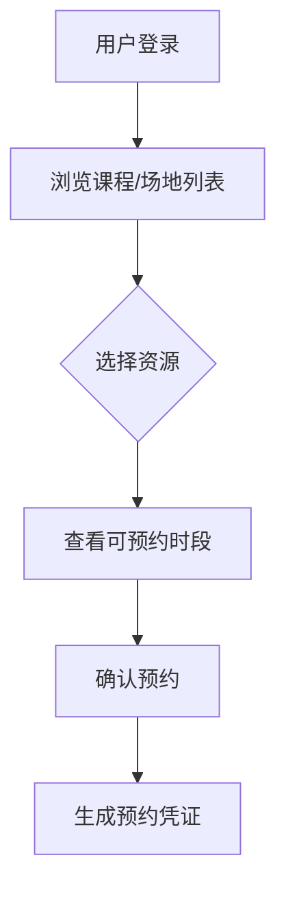
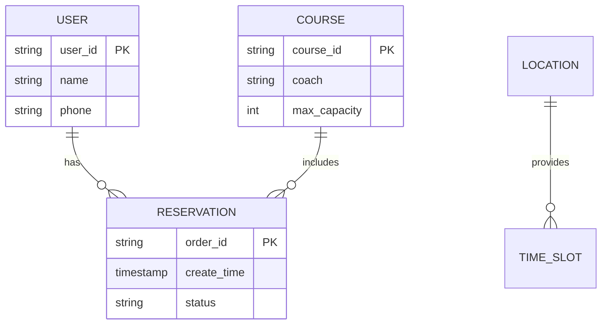

# 软件需求说明书：健身中心预约系统  
**版本号**：1.0  
**发布日期**：2025年7月7日  

---

## 3. 功能性需求  
### 3.1 核心功能流程  

```mermaid
graph TD
  A[用户登录] --> B[浏览课程/场地列表]
  B --> C{选择资源}
  C --> D[查看可预约时段]
  D --> E[确认预约]
  E --> F[生成预约凭证]
```

---

## 5. 数据需求  
### 5.1 核心数据实体

```mermaid
erDiagram
  USER ||--o{ RESERVATION : has
  COURSE ||--o{ RESERVATION : includes
  LOCATION ||--o{ TIME_SLOT : provides
  
  USER {
    string user_id PK
    string name
    string phone
  }
  RESERVATION {
    string order_id PK
    timestamp create_time
    string status
  }
  COURSE {
    string course_id PK
    string coach
    int max_capacity
  }
```
