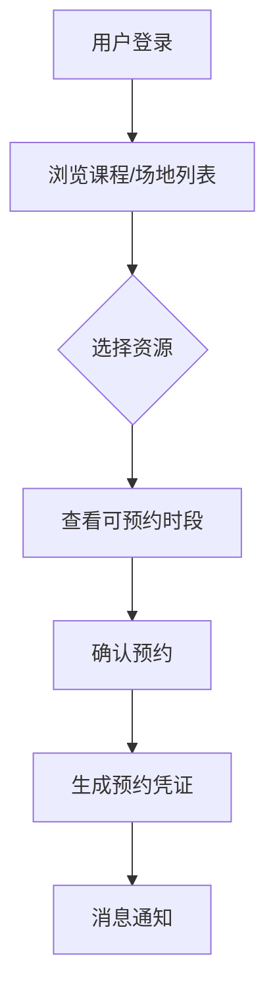
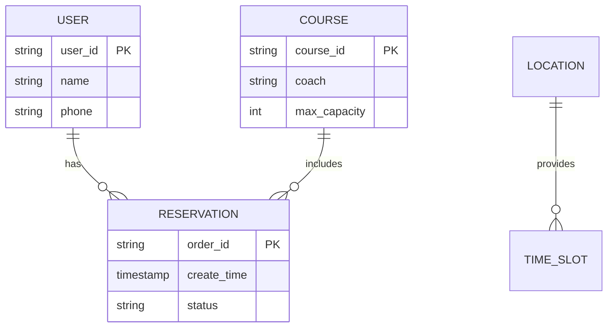

# 软件需求说明书：健身中心预约系统  
**版本号**：1.0  
**发布日期**：2025年7月7日  

---

## 1. 引言
### 1.1 目的  
为健身中心会员及管理员提供线上课程/场地预约服务，提升资源利用率与用户体验。  
### 1.2 范围  
- 会员：查看课程/场地、预约、取消预约、查看个人预约记录  
- 管理员：管理课程/场地资源、监控预约状态、调整预约规则  

---

## 2. 用户角色  
| 角色       | 权限描述                     |  
|------------|-----------------------------|  
| 会员       | 预约/取消本人预约、查看资源 |  
| 管理员     | 管理所有资源及预约规则      |  

---

## 3. 功能性需求  
### 3.1 核心功能流程  

### 3.2 详细需求说明  
| 功能模块       | 需求描述                                                     |  
|----------------|-------------------------------------------------------------|  
| **资源展示**   | 按日期/类型筛选课程（瑜伽/器械）、场地（篮球场/泳道）       |  
| **预约操作**   | 选择时段→确认→生成唯一预约码（冲突时段自动拦截）             |  
| **取消预约**   | 开课前≥2小时免费取消（后台可配置时限）                       |  
| **个人中心**   | 日历视图展示用户未来7天预约记录                              |  
| **后台管理**   | 增删课程/场地、设置容量、调整开放时间、导出预约报表          |  

以下是对**3.2 详细需求说明**的完整扩写，涵盖业务规则、异常处理及扩展场景：

---

### 3.2 详细需求说明  

#### **资源展示模块**  
| 要素 | 详细规则 |  
|------|----------|  
| **数据维度** | 可筛选：课程类型（瑜伽/搏击/器械指导）、场地类型（泳池/篮球场/私教区）、教练姓名、时段（早/午/晚） |  
| **状态标识** | <ul><li>可预约：绿色标签 + 剩余名额数</li><li>即将满员（剩余≤20%）：黄色标签</li><li>已满员：红色标签 + 候补入口</li><li>维修中：灰色标签 + 停用说明</li></ul> |  
| **排序逻辑** | 默认按时间升序，支持按热度（预约率）、评分（教练）手动排序 |  

#### **预约操作模块**  
| 步骤 | 系统行为 |  
|------|----------|  
| **时段选择** | <ul><li>时间颗粒度：30分钟（如 14:00-14:30）</li><li>冲突检测：自动屏蔽与已有预约重叠时段</li><li>容量检测：实时显示剩余名额（每5秒刷新）</li></ul> |  
| **确认提交** | <ul><li>二次弹窗提示：包含课程/场地名称、时段、教练</li><li>强制阅读《取消政策》（首次预约需勾选确认）</li></ul> |  
| **凭证生成** | <ul><li>唯一预约码：8位数字字母混合（如 A3B9-X2K8）</li><li>动态二维码：含用户ID+预约时段+场地编码</li><li>自动推送：站内消息+短信（含导航链接）</li></ul> |  

#### **取消预约模块**  
| 场景 | 处理规则 |  
|------|----------|  
| **用户主动取消** | <ul><li>免费期：开课前≥2小时（管理员可配置）</li><li>违约期：开课前2小时内（扣1次信用分）</li><li>操作路径：预约记录页→取消按钮→选择原因</li></ul> |  
| **系统强制取消** | <ul><li>触发条件：场地故障/教练缺席/天气灾害</li><li>补偿机制：赠送1次优先预约权限 + 消息通知</li><li>记录标注：在个人中心显示“系统取消”标签</li></ul> |  

#### **个人中心模块**  
| 功能 | 详细设计 |  
|------|----------|  
| **视图模式** | <ul><li>日历视图：按日/周切换，已预约时段高亮</li><li>列表视图：显示未来7天记录（含历史存档入口）</li></ul> |  
| **凭证管理** | <ul><li>动态状态：待使用/已完成/已取消/违约</li><li>快捷操作：取消按钮（仅限未开始预约） + 导航按钮</li><li>共享功能：生成临时访客二维码（限非私教课程）</li></ul> |  

#### **后台管理模块**  
| 功能 | 操作流程 |  
|------|----------|  
| **资源管理** | <ul><li>新增课程：设置名称/类型/教练/最大容量/关联场地</li><li>批量调整：按周复制排期模板 + 冲突检测</li><li>紧急停用：立即生效并通知已预约用户</li></ul> |  
| **规则引擎** | <ul><li>违约规则：爽约次数阈值（默认3次）→冻结天数（默认7天）</li><li>时段规则：设置不同日期类型的开放时段（如节假日缩短）</li><li>权限分配：按教练/前台角色分配管理范围</li></ul> |  
| **数据报表** | <ul><li>实时看板：各场地利用率曲线、课程满员率TOP10</li><li>导出字段：用户ID/预约时段/状态/渠道（APP/小程序）</li></ul> |  

---

### 补充说明  
#### **异常处理机制**  
1. **重复预约拦截**  
   - 同一用户同时段发起第二次预约 → 弹出提示："您已有XX时段的XX预约"  
   - 系统自动关闭当前页面并跳转至冲突预约详情页  

2. **突发满员处理**  
   - 用户提交时剩余名额为0 → 提示："名额已满，是否加入候补？"  
   - 候补队列：按加入顺序自动补位（开课前3小时截止）  

### 3.3 关键业务规则  
- **时段冲突控制**：同一用户同时间段仅允许1个有效预约  
- **容量限制**：课程预约数≤教练设置上限，场地预约数≤物理容量  
- **黑名单机制**：3次爽约自动冻结预约权限7天  

---

## 4. 非功能性需求  
| 类别       | 要求                          |  
|------------|-------------------------------|  
| **性能**   | 200并发用户下页面响应<2s      |  
| **可靠性** | 预约成功率达99.9%（除支付环节）|  
| **安全**   | 用户数据HTTPS传输、预约操作需登录验证 |  
| **兼容性** | 支持iOS/Android主流浏览器及微信内嵌页 |  

---

## 5. 界面原型关键点  
1. **首页日历组件**：可视化展示可预约日期（满额日期标红）  
2. **时段选择器**：以30分钟为颗粒度显示可选时段（如 14:00-14:30）  
3. **凭证页面**：含二维码、场地导航链接、取消按钮  

---

## 6. 数据需求  
### 6.1 核心数据实体

---

## 7. 假设与依赖
- 已存在用户账户体系（支持手机号登录）  
- 场馆WiFi覆盖扫码核销区域  
- 教练提前3日提交课程排期表  

---

## 8. 验收标准（示例）
| 场景                     | 预期结果                     |  
|--------------------------|------------------------------|  
| 会员预约已满课程         | 显示“已满员”且不可点击        |  
| 管理员修改课程最大容量   | 历史预约不变，新预约按新规则 |  
| 开课前1小时取消          | 系统拒绝并提示违约政策       |  
