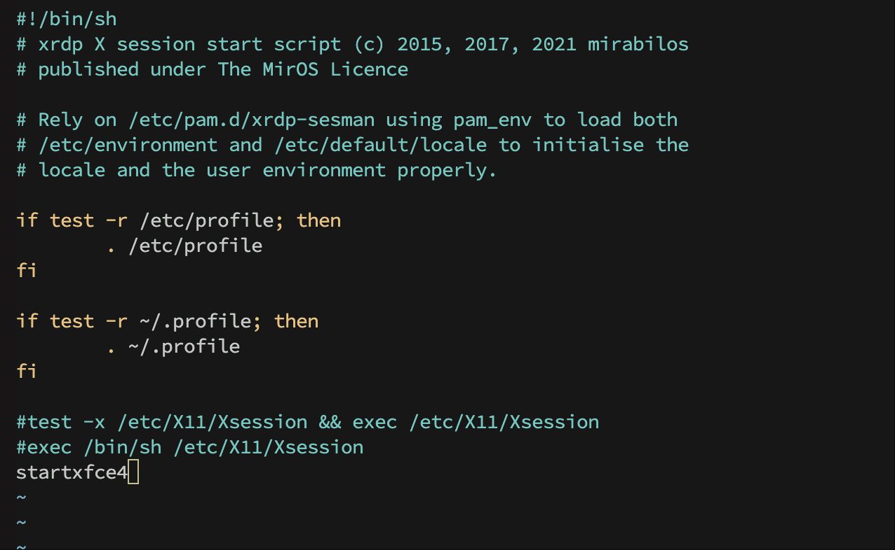
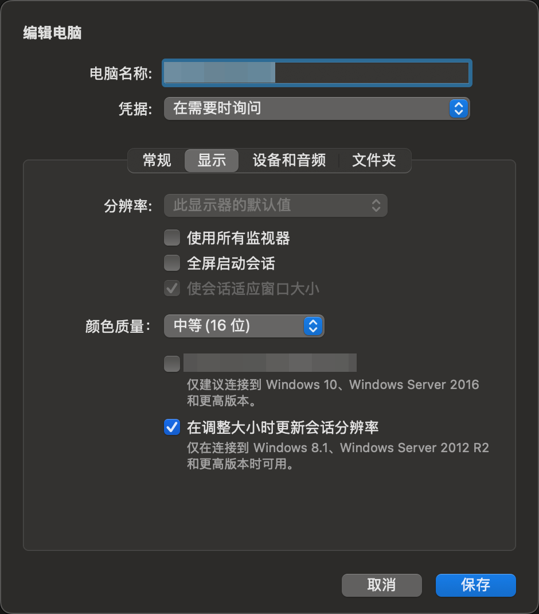
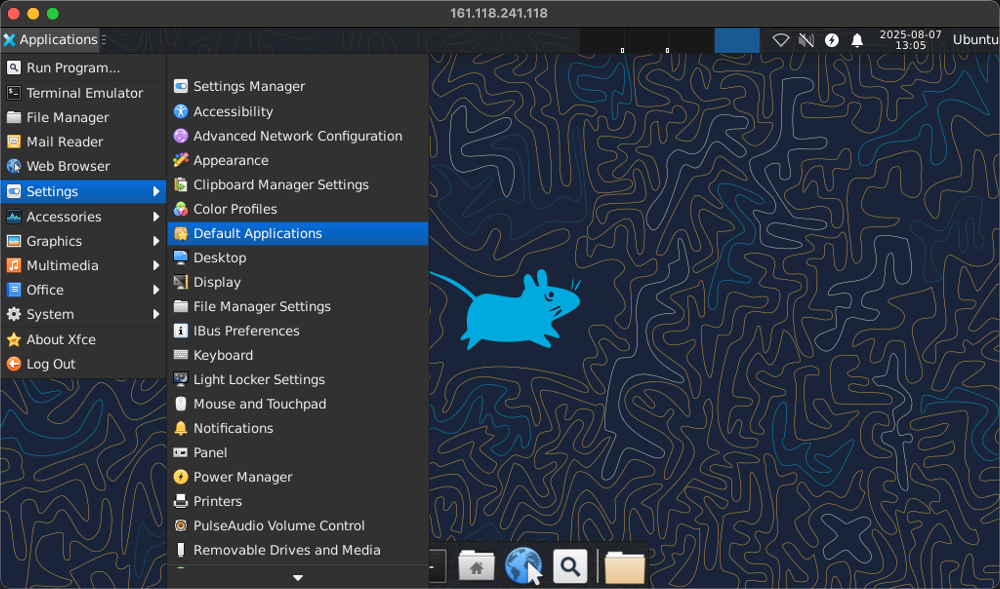

# 在 Linux VM 上安装桌面环境


## 一、连接SSH

首先，通过 SSH 连接到 VM。以下示例使用用户名连接到 x.x.x.x 的 VM。

```bash
ssh root@x.x.x.x
```

## 二、安装 xfce

先确认是否已有桌面环境

```bash
ls /usr/share/xsessions
```

若无法找到，可使用 apt 安装 xfce：

```bash
sudo apt-get update
sudo apt install xfce4 xfce4-goodies
```

## 三、安装 xrdp

使用 apt 安装 xrdp：

```bash
sudo apt update
sudo apt install xrdp
```

安装完成后，你可以通过输入 `xrdp --version` 来检查 xrdp 是否成功安装。

## 四、配置 xrdp

xrdp 的配置文件位于 `/etc/xrdp/xrdp.ini`。

xrdp 使用的默认会话管理器 sesman 的配置文件位于 `/etc/xrdp/sesman.ini` 

修改配置 XRDP 服务器的脚本文件：

```bash
sudo vim /etc/xrdp/startwm.sh
```

注释原有 test 行和 exec 行，增加 startxfce4




## 五、启动 xrdp 服务

安装和配置完成后，就可以启动 xrdp 服务了。在终端中输入以下命令启动服务：

```bash
sudo systemctl start xrdp
```

如果你想让 xrdp 在系统启动时自动运行，可以使用以下命令设置开机自启：

```bash
sudo systemctl enable xrdp
```

修改配置文件后，重启服务可使用如下命令：

```bash
sudo systemctl restart xrdp
```

### 设置本地用户帐户密码

xrdp 无法接受使用 SSH 密钥进行身份验证。如果在创建 VM 时已为用户帐户创建密码，请跳过此步骤。如果仅使用 SSH 密钥身份验证，请使用如下命令指定用户的密码。

```bash
sudo passwd root
```

## 六、远程连接

使用任何支持 RDP 协议的远程桌面客户端（如 Windows 的远程桌面连接、Mac 的 Windows App 等）来连接服务器。

在客户端中输入服务器的 IP 地址和端口号（默认为 3389），点击连接。

## 七、故障排除

### 无法连接

如果无法使用远程桌面客户端连接到 Linux VM，请在 Linux VM 上使用 netstat 验证 VM 是否正在侦听 RDP 连接，如下所示：

```bash
sudo netstat -plnt | grep rdp
```

以下示例显示正在按预期方式侦听 TCP 端口 3389 的 VM：

```
tcp     0     0      127.0.0.1:3350     0.0.0.0:*     LISTEN     53192/xrdp-sesman
tcp     0     0      0.0.0.0:3389       0.0.0.0:*     LISTEN     53188/xrdp
```

如果 xrdp-sesman 服务未在侦听，请在 Ubuntu VM 上重新启动该服务，如下所示：

```bash
sudo systemctl restart xrdp
```

可查看 Ubuntu VM 上的 `/var/log/syslog` 中的日志：

```bash
tail -f /var/log/syslog
```

### 连接黑屏或响应缓慢

有可能是网速问题，稍等一会就可以显示。可以通过如下方法降低显示质量，减少数据传输，提升连接稳定性
    
1. 在远程终端中设置xrdp.ini，将 max_bpp=32 改为 max_bpp=16

2. 在rdp客户端中手动设置降低的分辨率，设置颜色质量



如果仍遇到黑屏问题，可能是因为本地会话没有注销。在 Ubuntu 上注销当前用户，然后重新连接即可解决。

### 远程桌面中终端无法打开
 
1. 点击左上角"Application - Settings - Default Applications"


2. 在"Utilities"选项中，将"Terminal Emulator"改为"Xfce Terminal"

3. 然后重启远程桌面链接，再进入即可正常打开终端

### 远程桌面中无法打开浏览器

1. 使用终端安装浏览器

```bash
    sudo apt install firefox
```

2. 点击左上角"Application - Settings - Default Applications"，设置默认浏览器

## 参考资料

- https://learn.microsoft.com/zh-cn/azure/virtual-machines/linux/use-remote-desktop?tabs=azure-cli
- https://developer.baidu.com/article/details/3281932
- https://cloud.baidu.com/article/3281923
- https://blog.csdn.net/2301_76459044/article/details/147031270